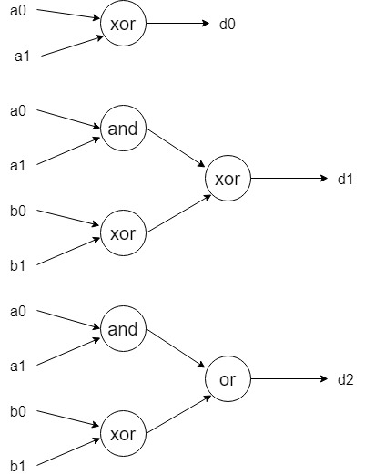
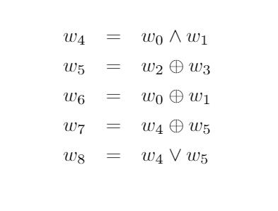

## An example of  QSP 

consider the binary adder circuit of two 2-bit integers, where the input wires are `a0, a1, b0, b1` and the output wires are `d0, d1, d2` which satisfy
> `d0 = a0 xor b0`, 
>
> `d1 = (a1 xor b1) xor (a0 and b0)`,
>
> `d2 = (a1 xor b1) or (a0 and b0)`.

This computation can be visualized as a *boolean circuit* or a *equation constraint* between bool varibles.

bool circuit representation | algebraic equation constraint 
-|-
|

To make NIZK more easier to build and to shorter the proof size, it's important to **compress** this equation constraint into a QSP. 

The canonical QSP for this binary adder is .

